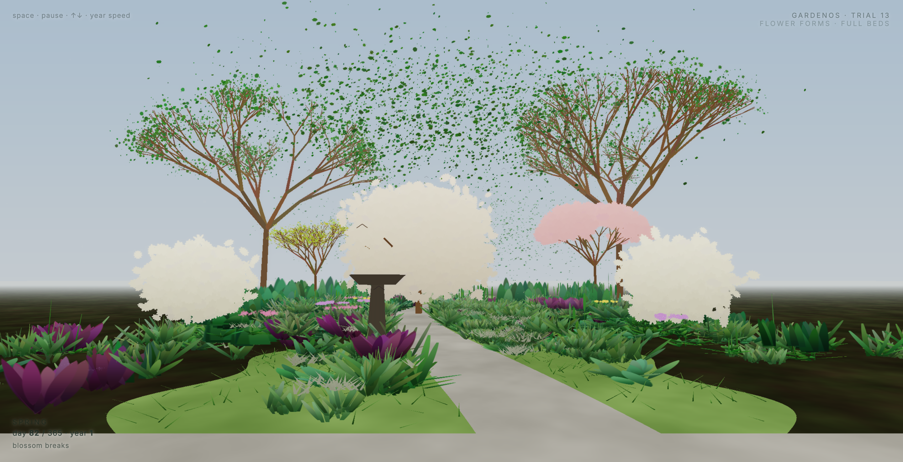
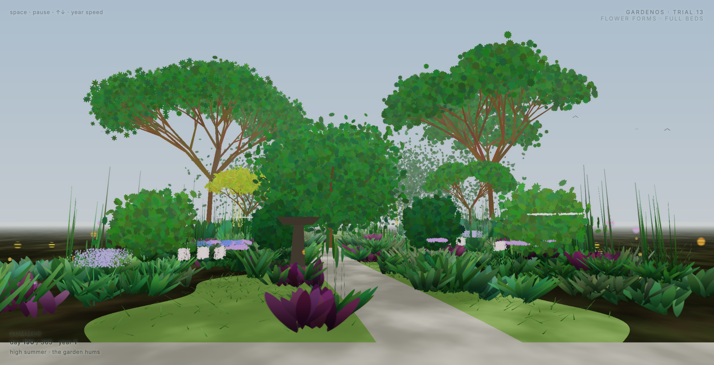
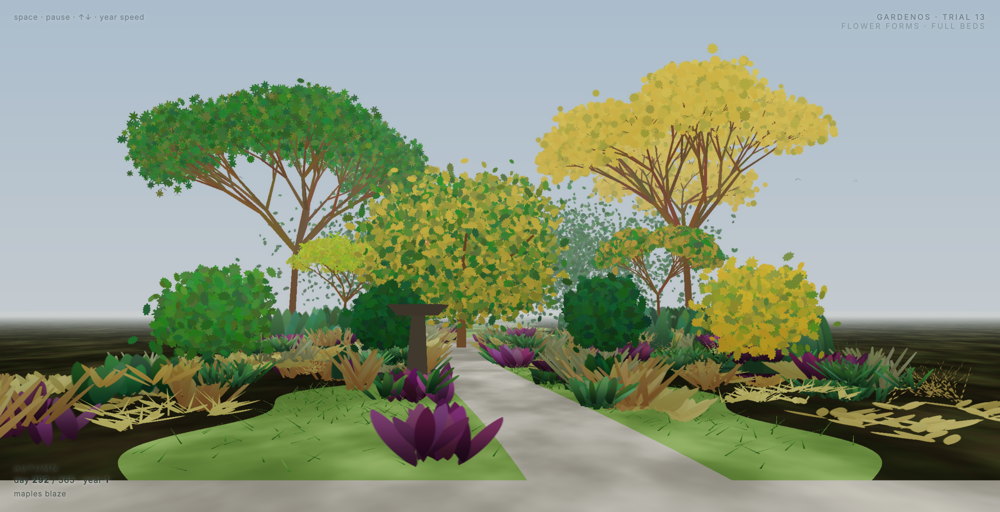
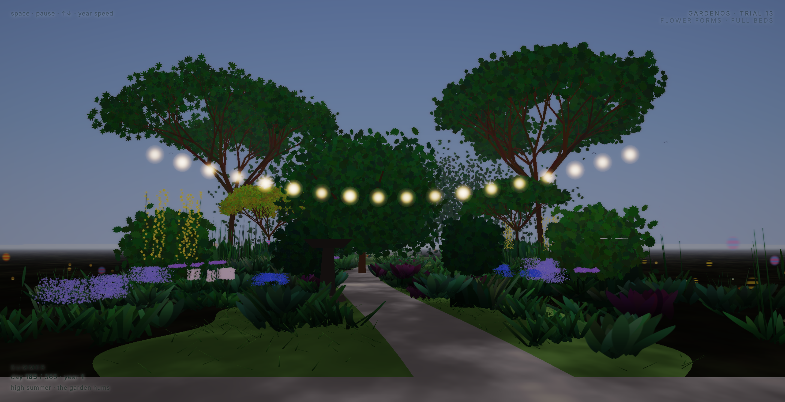

# GardenOS

**A generative London cottage garden that grows through a whole year — in a single self-contained web page.**

You stand inside the border and look out. Bulbs push up in late winter, the apple and cherry break into blossom, summer fills the beds while bees work the flowers and birds visit the bird bath, the trees turn — each in its own time and colour — apples ripen and fall, winter strips it back to bare branches and evergreen structure. And a slow day/night drifts over the top, so dusk falls and the patio lights come on.

It's a real garden: Andy's London N1 garden, rebuilt from the ground up, one note at a time.

## ▶ See it

| | |
|---|---|
| **Live (open in a browser)** | https://eternal-birch-wjhm.here.now/ |
| **The build journey (making-of film, 2:24)** | https://topaz-realm-j587.here.now/ |
| **Showcase film (a year in 80s)** | https://misty-riddle-zz7x.here.now/ |

The films are also in [`video/`](video/). Controls in the live page: **space** = pause · **↑ ↓** = year speed.

## The garden, through the year

| Spring | Summer | Autumn | Dusk |
|---|---|---|---|
|  |  |  |  |

## Run it locally

No build step. It's one HTML file that loads Three.js from a CDN:

```bash
open trial-13-flowerforms.html        # macOS
# or just double-click it, or serve the folder
```

## How it's built

One Three.js scene, ~80,000 **instanced billboards**, two render passes (scene → post). Everything is data-driven and animated in the shaders from three globals: `day` (0–365), `time`, and `sun` (time of day).

- **Trees** grow real branch skeletons (trunk → limbs → recursive twigs); leaves tuft on the outer twigs (backdrop trees) or fill a dense crown (the feature **apple** tree). A **cherry** blossoms pink on bare branches; a **maple** burns to scarlet; an evergreen hedge holds green.
- **Per-tree autumn**: each tree turns at its own time *and* its own hue.
- **Ground**: shared `bedEdge(z)`/`pathC(z)` carve mown lawn (real grass blades) / earth beds / a stone path / patio.
- **Planting**: ~23 named London cottage/woodland species, each with its own lifecycle (wake / flower / brown / sleep / evergreen) → a unified seasonal clock.
- **Flowers** are built from florets in real shapes (spike, globe, umbel, mophead, head, haze…).
- **Life**: wind, five kinds of pollinator, a flock of birds, a bird bath, apples, windfall, dusk + warm patio string lights.

Full technical spec in [`documentary/MODEL.md`](documentary/MODEL.md) (the six-layer design) and [`documentary/ARCHITECTURE.md`](documentary/ARCHITECTURE.md) (the abstract-substrate branch).

## The build journey

This was built in a tight loop — build, screenshot, react, iterate — over ~20 steps, from an abstract "ecological time as light" sketch, through a GPGPU reaction–diffusion engine that emerged and then collapsed, a "petri dish, not a garden" pivot to first person, and a long representational climb to the cottage garden you see now.

The whole story, step by step (question → decision → what we tried → what we learned), is in [`documentary/LOG.md`](documentary/LOG.md), with the structured version in [`documentary/manifest.json`](documentary/manifest.json) and 60+ progression screenshots in [`documentary/captures/`](documentary/captures/). The making-of film walks through it.

## Repo layout

```
trial-01 … trial-13-*.html   the build lineage (trial-13-flowerforms.html = the live engine)
documentary/                 LOG.md, manifest.json, MODEL.md, ARCHITECTURE.md, captures/
video/                       the two films + the scripts that made them (record.mjs, build_slideshow.mjs)
```

## Credits

Built by [Andy Birdseye](https://github.com/b1rdmania) in conversation with Claude. Rendering: [Three.js](https://threejs.org). Hosting: [here.now](https://here.now). Build-journey voiceover: ElevenLabs.
